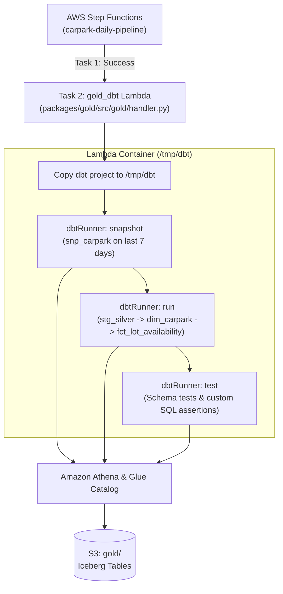

# Gold Layer Documentation

The **Gold Layer** is the analytical and dimensional modeling tier of the Carpark Availabilities Data Platform. It transforms partitioned Silver Parquet data into high-performance **Apache Iceberg** dimensional and fact models managed by [dbt-athena](https://github.com/dbt-athena/dbt-athena) on Amazon Athena and S3.

---

## 1. Overview & Architecture

* **Data Modeling Paradigm**: Star Schema with Slowly Changing Dimensions (SCD Type 2).
* **Storage Engine**: Apache Iceberg tables in S3 (providing ACID transactions, snapshot isolation, and partition evolution).
* **Orchestration**: Triggered as **Step 2** in the daily **AWS Step Functions State Machine** (`carpark-daily-pipeline`) immediately following successful Silver consolidation.
* **Execution Environment**: Containerized AWS Lambda function (`gold_dbt`) running Python 3.13 on ARM64 Graviton architecture.
* **Query Engine**: Amazon Athena (`ap-southeast-1`, `awsdatacatalog`).



---

## 2. Containerized Lambda Execution (`gold_dbt`)

AWS Lambda file systems are read-only except for `/tmp`. The Gold Lambda handler (`packages/gold/src/gold/handler.py`):
1. Copies the dbt project structure (`models/`, `snapshots/`, `tests/`, `macros/`, `dbt_project.yml`, `profiles.yml`) into `/tmp/dbt`.
2. Programmatically executes dbt commands in sequence using `dbtRunner`:
   - `dbt snapshot --project-dir /tmp/dbt --profiles-dir /tmp/dbt`
   - `dbt run --project-dir /tmp/dbt --profiles-dir /tmp/dbt`
   - `dbt test --project-dir /tmp/dbt --profiles-dir /tmp/dbt`
3. Captures run results and raises an execution error on any failed stage or test failure, causing the Step Functions state machine to fail and raise CloudWatch alerts.

---

## 3. Dimensional Data Models

### 3.1 Staging View: `stg_silver__carpark_snapshots`
* **File**: [`models/staging/stg_silver__carpark_snapshots.sql`](file:///c:/Users/sheng/OneDrive/Documents/Carpark-Availabilities-Data/packages/gold/models/staging/stg_silver__carpark_snapshots.sql)
* **Materialization**: `view` (Schema: `staging`)
* **Purpose**: Deduplicates and cleans raw snapshots from `silver.silver_cold` taking the latest record per `(carpark_id, lot_type, snapshot_timestamp)`.
* **Key Columns**: Generates surrogate key `snapshot_id = to_hex(md5(to_utf8(concat(carpark_id, '|', lot_type, '|', cast(snapshot_timestamp as varchar)))))`.

---

### 3.2 Dimension Snapshot: `snp_carpark`
* **File**: [`snapshots/snp_carpark.sql`](file:///c:/Users/sheng/OneDrive/Documents/Carpark-Availabilities-Data/packages/gold/snapshots/snp_carpark.sql)
* **Strategy**: `check` on `['total_lots', 'development', 'area', 'agency', 'location_latitude', 'location_longitude']`
* **Unique Key**: `to_hex(md5(to_utf8(concat(carpark_id, '|', lot_type))))`
* **Performance Optimization**: Narrows scan window to the last 7 days (`snapshot_timestamp >= current_timestamp - interval '7' day`) to optimize Athena query performance and cost while capturing all active carpark state transitions.

---

### 3.3 Dimension Table: `dim_carpark`
* **File**: [`models/dimensions/dim_carpark.sql`](file:///c:/Users/sheng/OneDrive/Documents/Carpark-Availabilities-Data/packages/gold/models/dimensions/dim_carpark.sql)
* **Materialization**: `incremental` (Apache Iceberg Table, merge strategy)
* **Primary Key**: `carpark_key = to_hex(md5(to_utf8(concat(carpark_id, '|', lot_type, '|', cast(dbt_valid_from as varchar)))))`
* **Columns**:
  * `carpark_key` (Surrogate Key)
  * `carpark_id` (Natural ID)
  * `lot_type`
  * `total_lots`
  * `development`
  * `area`
  * `agency`
  * `location_latitude`, `location_longitude`
  * `valid_from`, `valid_to`
  * `is_current` (Boolean flag)

---

### 3.4 Fact Table: `fct_lot_availability`
* **File**: [`models/facts/fct_lot_availability.sql`](file:///c:/Users/sheng/OneDrive/Documents/Carpark-Availabilities-Data/packages/gold/models/facts/fct_lot_availability.sql)
* **Materialization**: `incremental` (Apache Iceberg Table, partitioned by `snapshot_date`)
* **Primary Key**: `availability_id`
* **Point-in-Time Join**: Joins snapshots to `dim_carpark` where:
  ```sql
  s.snapshot_timestamp >= d.valid_from 
  AND (s.snapshot_timestamp < d.valid_to OR d.valid_to IS NULL)
  ```
* **Enriched Metrics**:
  * `lots_occupied = total_lots - lots_available`
  * `occupancy_rate = round((total_lots - lots_available) / total_lots, 4)`
  * `is_full = (lots_available == 0)`

---

## 4. Data Quality & Assertion Tests

Custom SQL tests in [`tests/`](file:///c:/Users/sheng/OneDrive/Documents/Carpark-Availabilities-Data/packages/gold/tests/) enforce domain integrity on every execution:

| Test Name | File | Rule Enforced |
| :--- | :--- | :--- |
| **Singapore Geo Bounds** | `assert_singapore_geo_bounds.sql` | Carpark coordinates must fall within Singapore bounds ($1.15 \le \text{Lat} \le 1.48$, $103.55 \le \text{Lon} \le 104.10$). |
| **Capacity Constraint** | `assert_lots_available_le_total_lots.sql` | `lots_available` must never exceed `total_lots` when `total_lots` is defined. |
| **Occupancy Rate Range** | `assert_occupancy_rate_bounds.sql` | `occupancy_rate` must be within $[0.0, 1.0]$ ($0\%$ to $100\%$). |
| **SCD2 Overlap Check** | `assert_scd2_no_overlaps.sql` | No overlapping `[valid_from, valid_to)` intervals for any `(carpark_id, lot_type)`. |

---

## 5. Local Development & Makefile Commands

The root Makefile provides convenience targets for local testing with `uv`:

```bash
# 1. Fast local compilation check (validates SQL/Jinja/YAML without querying Athena)
make dbt_parse

# 2. Test Athena connection and S3 bucket permissions
make dbt_debug

# 3. Execute SCD Type 2 snapshot
make dbt_snapshot

# 4. Build staging views, dimensions, and facts
make dbt_run

# 5. Run full suite of generic schema tests and custom SQL assertions
make dbt_test
```

---

## 6. Manual Step Functions Execution

To trigger the full daily pipeline (Silver $\rightarrow$ Gold) manually via AWS CLI:

```bash
# Get the state machine ARN from Terraform
SFN_ARN=$(terraform -chdir=infra/app output -raw step_function_arn)

# Trigger execution
aws stepfunctions start-execution \
  --state-machine-arn "$SFN_ARN" \
  --name "manual-run-$(date +%s)"
```
