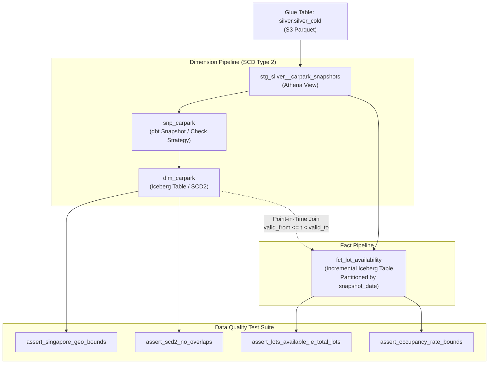

# Gold Layer Documentation

The **Gold Layer** is the analytical and dimensional modeling tier of the Carpark Availabilities Data Platform. It transforms partitioned Silver Parquet data into high-performance **Apache Iceberg** dimensional and fact models managed by [dbt-athena](https://github.com/dbt-athena/dbt-athena) on Amazon Athena and S3.

---

## 1. Overview & Objectives

* **Data Modeling Paradigm**: Star Schema with Slowly Changing Dimensions (SCD Type 2).
* **Storage Engine**: Apache Iceberg tables in S3 (providing ACID transactions, snapshot isolation, and partition evolution).
* **Orchestration / Modeling Tool**: [dbt](https://www.getdbt.com/) (`packages/gold`).
* **Query Engine**: Amazon Athena (`ap-southeast-1`, `awsdatacatalog`).



---

## 2. Model Architecture

### 2.1 Staging View: `stg_silver__carpark_snapshots`
* **File**: [`models/staging/stg_silver__carpark_snapshots.sql`](file:///c:/Users/sheng/OneDrive/Documents/Carpark-Availabilities-Data/packages/gold/models/staging/stg_silver__carpark_snapshots.sql)
* **Materialization**: `view` (Schema: `staging`)
* **Key Operations**:
  * Casts types and trims text fields.
  * Generates surrogate primary key `snapshot_id = md5(carpark_id | lot_type | snapshot_timestamp)`.
  * Normalizes missing coordinates and values.

---

### 2.2 Dimension Snapshot: `snp_carpark`
* **File**: [`snapshots/snp_carpark.sql`](file:///c:/Users/sheng/OneDrive/Documents/Carpark-Availabilities-Data/packages/gold/snapshots/snp_carpark.sql)
* **Strategy**: `check` on `['total_lots', 'development', 'area', 'agency', 'location_latitude', 'location_longitude']`
* **Unique Key**: `md5(carpark_id | lot_type)`
* **Purpose**: Captures changes over time when carpark capacity is upgraded, coordinates are remapped, or names/developments change.

---

### 2.3 Dimension Table: `dim_carpark`
* **File**: [`models/dimensions/dim_carpark.sql`](file:///c:/Users/sheng/OneDrive/Documents/Carpark-Availabilities-Data/packages/gold/models/dimensions/dim_carpark.sql)
* **Materialization**: `incremental` (Iceberg Table, Merge Strategy)
* **Primary Key**: `carpark_key = md5(carpark_id | lot_type | dbt_valid_from)`
* **Columns**:
  * `carpark_key` (Surrogate Key)
  * `carpark_id` (Natural ID)
  * `lot_type`
  * `total_lots`
  * `development`
  * `area`
  * `agency`
  * `location_latitude`, `location_longitude`
  * `valid_from`, `valid_to`
  * `is_current` (Boolean flag)

---

### 2.4 Fact Table: `fct_lot_availability`
* **File**: [`models/facts/fct_lot_availability.sql`](file:///c:/Users/sheng/OneDrive/Documents/Carpark-Availabilities-Data/packages/gold/models/facts/fct_lot_availability.sql)
* **Materialization**: `incremental` (Iceberg Table, Partitioned by `snapshot_date`)
* **Primary Key**: `availability_id`
* **Point-in-Time Join**: Joins snapshots to `dim_carpark` where:
  ```sql
  s.snapshot_timestamp >= d.valid_from 
  AND (s.snapshot_timestamp < d.valid_to OR d.valid_to IS NULL)
  ```
* **Enriched Metrics**:
  * `lots_occupied = total_lots - lots_available`
  * `occupancy_rate = round((total_lots - lots_available) / total_lots, 4)`
  * `is_full = (lots_available == 0)`

---

## 3. Data Quality & Assertion Tests

Custom SQL tests in [`tests/`](file:///c:/Users/sheng/OneDrive/Documents/Carpark-Availabilities-Data/packages/gold/tests/) enforce domain integrity:

| Test Name | File | Rule Enforced |
| :--- | :--- | :--- |
| **Singapore Geo Bounds** | `assert_singapore_geo_bounds.sql` | Carpark coordinates must fall within Singapore bounds ($1.15 \le \text{Lat} \le 1.48$, $103.55 \le \text{Lon} \le 104.10$). |
| **Capacity Constraint** | `assert_lots_available_le_total_lots.sql` | `lots_available` must never exceed `total_lots` when `total_lots` is defined. |
| **Occupancy Rate Range** | `assert_occupancy_rate_bounds.sql` | `occupancy_rate` must be within $[0.0, 1.0]$ ($0\%$ to $100\%$). |
| **SCD2 Overlap Check** | `assert_scd2_no_overlaps.sql` | No overlapping `valid_from` to `valid_to` intervals for any `(carpark_id, lot_type)`. |

---

## 4. dbt Commands & Local Execution

The project root Makefile exposes convenience targets to run dbt tasks using `uv`:

```bash
# 1. Test Athena connection and S3 bucket permissions
make dbt_debug

# 2. Execute SCD Type 2 snapshot
make dbt_snapshot

# 3. Build staging views, dimensions, and facts
make dbt_run

# 4. Run full suite of generic schema tests and custom SQL assertions
make dbt_test
```

### Direct dbt CLI commands:
```bash
# Run a specific model
uv run --package gold dbt run --project-dir packages/gold --select dim_carpark

# Run only singular data quality tests
uv run --package gold dbt test --project-dir packages/gold --select test_type:singular
```

