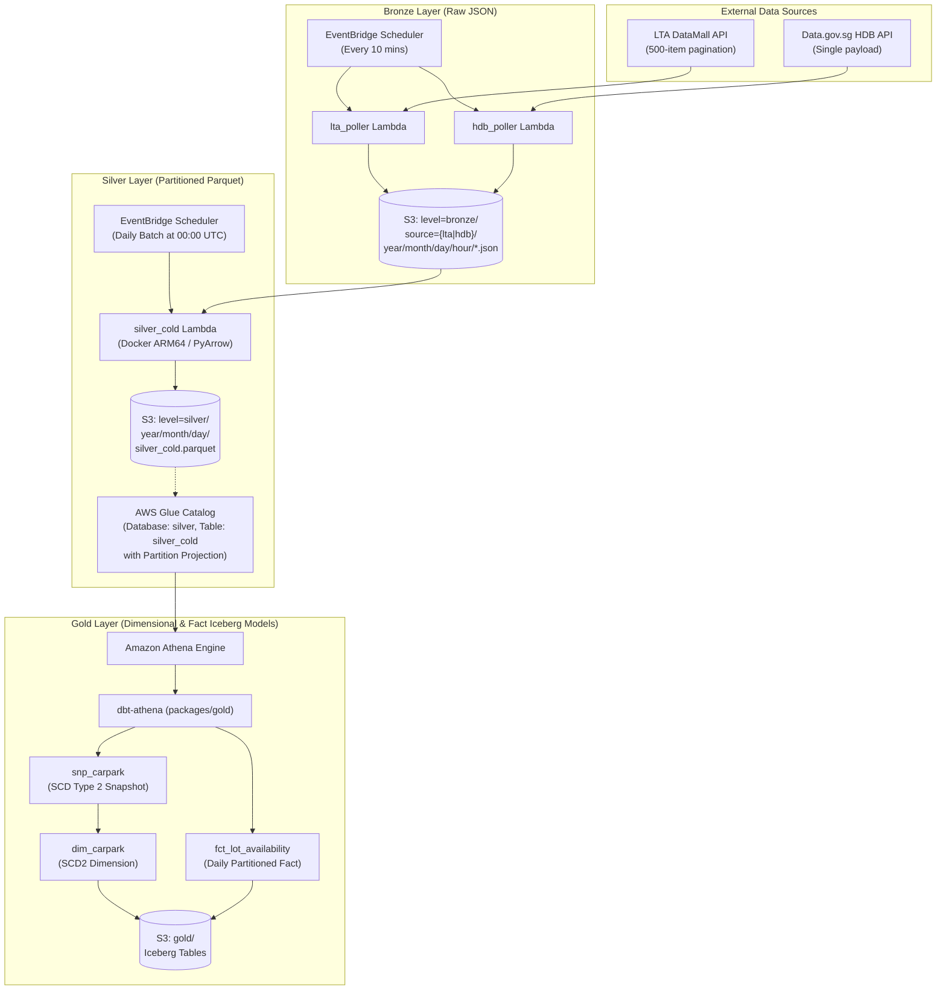

# Architecture & Developer Overview

Welcome to the **Carpark Availabilities Data Platform** developer documentation. This document provides a high-level overview of the platform architecture, monorepo structure, prerequisites, environment configuration, and end-to-end development workflow.

---

## 1. System Architecture

The platform implements a serverless **Medallion Data Architecture** (Bronze $\rightarrow$ Silver $\rightarrow$ Gold) on AWS to ingest, clean, snapshot, and model carpark availability metrics across Singapore (LTA, HDB, URA).



---

## 2. Monorepo & Directory Structure

The project is structured as a Python monorepo using [`uv` workspaces](https://docs.astral.sh/uv/concepts/workspaces/) and modular Terraform infrastructure:

```text
.
├── Makefile                     # Root build, push, deploy, and dbt tasks
├── pyproject.toml               # Monorepo root uv workspace configuration
├── docs/                        # Architecture and developer documentation
│   ├── overview.md              # System overview & developer guide
│   ├── bronze.md                # Bronze ingestion layer details
│   ├── silver.md                # Silver transformation & validation details
│   └── gold.md                  # Gold dbt & dimensional modeling details
├── infra/                       # Terraform infrastructure definitions
│   ├── bootstrap/               # IAM roles (bootstrap, ecr-builder, app-builder)
│   ├── ecr/                     # AWS ECR repository management
│   └── app/                     # S3, Lambda, EventBridge, and Glue definitions
└── packages/                    # Python and dbt sub-packages
    ├── lta_poller/              # Lambda: Ingest LTA DataMall availability data
    ├── hdb_poller/              # Lambda: Ingest Data.gov.sg HDB availability data
    ├── silver_cold/             # Lambda: Batch process raw Bronze into Silver Parquet
    ├── silver_hot/              # Lambda: Near real-time processing (future)
    └── gold/                    # dbt project (Athena / Iceberg models & tests)
```

---

## 3. Prerequisites & Tooling

Ensure the following tools are installed on your workstation:

| Tool | Minimum Version | Purpose |
| :--- | :--- | :--- |
| **Python** | `3.13+` | Python runtime across all Lambda packages |
| **uv** | `latest` | Fast Python package manager and workspace runner |
| **Terraform** | `1.5+` | Infrastructure as Code (IaC) provisioning |
| **Docker** | `latest` | Multi-platform container builds (`linux/arm64`) |
| **AWS CLI v2** | `latest` | AWS authentication and profile management |
| **GNU Make** | `3.81+` | Build & workflow orchestration via `Makefile` |

---

## 4. Environment Configuration

### 4.1 `.env` File Setup
Create a `.env` file at the root of the project with the following variables:

```bash
# AWS Credentials
ACCOUNT_ID="123456789012"
AWS_REGION="ap-southeast-1"
TF_VAR_ACCESS_KEY="AKIA..."
TF_VAR_SECRET_KEY="secret..."

# ECR Configuration
ECR_REPO_NAME="carpark-availabilities"

# External API Keys
DATAMALL_ACCOUNT_KEY="your-lta-datamall-api-key"

# Optional IAM Profile Overrides
BOOTSTRAP_PROFILE="bootstrap"
ECR_BUILDER_PROFILE="ecr-builder"
APP_BUILDER_PROFILE="app-builder"
```

### 4.2 AWS IAM Role Separation
The deployment uses least-privilege IAM profiles configured automatically:
* `bootstrap`: Used to initialize infrastructure and create specific deployment roles.
* `ecr-builder`: Scoped permissions to create and push Docker images to Amazon ECR.
* `app-builder`: Permissions to provision S3, Lambda, Glue, and EventBridge resources.

Run the profile bootstrap target:
```bash
make bootstrap
```

---

## 5. Local Development Workflow

### 5.1 Python Workspace & Dependencies
Sync all dependencies across all packages in the workspace:
```bash
uv sync --all-packages
```

Run linters, type checkers, and unit tests:
```bash
# Code formatting and linting
uv run ruff check .
uv run ruff format --check .

# Type checking
uv run mypy packages/

# Run pytest suite
uv run pytest
```

---

## 6. Build & Deployment Lifecycle

The end-to-end deployment workflow is orchestrated via `Makefile`:

```bash
# 1. Initialize all Terraform directories
make terraform_init

# 2. Configure AWS CLI profiles and provision IAM roles
make bootstrap

# 3. Create the Amazon ECR Repository
make ecr_up

# 4. Build Docker container images for Lambda (ARM64 architecture)
make build

# 5. Push Docker container images to ECR
make push

# 6. Extract image digests and apply Terraform app infrastructure
make deploy
```

---

## 7. Documentation Navigation

* **[Bronze Layer Guide](bronze.md)**: Poller Lambdas, external APIs, pagination, rate limiting, and S3 raw JSON storage.
* **[Silver Layer Guide](silver.md)**: Daily batch transformation, Pydantic schema validation, PyArrow Parquet writer, and Glue external table with partition projection.
* **[Gold Layer Guide](gold.md)**: dbt project configuration, Athena / Iceberg models, SCD Type 2 snapshots, fact tables, and data quality tests.

