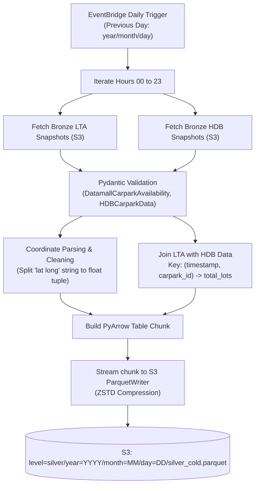

# Silver Layer Documentation

The **Silver Layer** is the cleansed, normalized, and validated tier of the Carpark Availabilities Data Platform. It transforms raw Bronze JSON snapshots into structured, columnar Apache Parquet files on S3 and registers them in the AWS Glue Data Catalog for high-performance SQL querying via Amazon Athena.

---

## 1. Overview & Architecture

* **Format**: Apache Parquet with **ZSTD** compression.
* **Execution Model**: Containerized AWS Lambda function (`silver_cold`) running on ARM64 architecture.
* **Processing Pattern**: Daily batch reconciliation covering the previous 24 hours of Bronze data (`00:00` to `23:50` UTC).
* **Streaming Writes**: Streams Parquet row groups hour-by-hour using `pyarrow.fs.S3FileSystem` and `pyarrow.parquet.ParquetWriter` to keep Lambda memory usage minimal (< 512 MB).
* **Catalog Registration**: Managed in the AWS Glue Data Catalog (`silver.silver_cold`) with **Partition Projection** enabled.

---

## 2. Ingestion & Transformation Logic

The batch transformer (`packages/silver_cold/src/silver_cold/handler.py`) performs the following steps:



### 2.1 Coordinate Parsing
Raw LTA payloads provide `Location` as a single space-delimited string (e.g. `"1.29375 103.85718"`). The Silver layer parses this into separate `location_latitude` and `location_longitude` `float64` fields, safely trapping malformed entries.

### 2.2 Capacity Enrichment
LTA DataMall provides real-time `AvailableLots` but omits `total_lots` (capacity). The HDB dataset provides both `lots_available` and `total_lots`. The Silver layer merges them on `(snapshot_timestamp, carpark_id)` to attach static/current capacity metrics where available.

---

## 3. Schema & Data Types

The Silver Parquet tables adhere to a strict PyArrow schema:

| Column Name | Data Type | Nullable | Description / Source |
| :--- | :--- | :--- | :--- |
| `carpark_id` | `string` | **No** | Native unique identifier (e.g., `C1`, `ACB`, `HE12`) |
| `snapshot_timestamp` | `timestamp[us, UTC]` | **No** | 10-minute floored UTC timestamp |
| `lot_type` | `string` | **No** | Vehicle category: `C` (Car), `H` (Heavy), `Y` (Motorcycle), `S` (Special), `unknown` |
| `lots_available` | `int32` | **No** | Verified available parking spaces ($\ge 0$) |
| `total_lots` | `int32` | Yes | Total capacity enriched from HDB data ($\ge 0$) |
| `location_latitude` | `float64` | Yes | Extracted latitude coordinate (Singapore: ~1.15 to 1.48) |
| `location_longitude`| `float64` | Yes | Extracted longitude coordinate (Singapore: ~103.55 to 104.10) |
| `area` | `string` | Yes | Regional area tag (e.g., `Marina`, `Orchard`, `Jurong`) |
| `development` | `string` | Yes | Building, estate, or development name |
| `agency` | `string` | **No** | Managing agency: `HDB`, `LTA`, or `URA` |
| `ingestion_timestamp`| `timestamp[us, UTC]` | **No** | Timestamp when the Silver Lambda executed |
| `source_filepath` | `string` | **No** | S3 lineage reference to the source Bronze JSON file |

---

## 4. S3 Partitioning & AWS Glue Partition Projection

### 4.1 S3 File Layout
```text
s3://<BUCKET_NAME>/level=silver/year=<YYYY>/month=<MM>/day=<DD>/silver_cold.parquet
```

### 4.2 Glue Catalog Partition Projection
The AWS Glue table [`silver_cold`](file:///c:/Users/sheng/OneDrive/Documents/Carpark-Availabilities-Data/infra/app/glue.tf#L11-L51) uses **Partition Projection**, eliminating the need for periodic partition crawlers or `MSCK REPAIR TABLE` queries.

```hcl
parameters = {
  "EXTERNAL"                  = "TRUE"
  "parquet.compression"       = "ZSTD"
  "classification"            = "parquet"
  "projection.enabled"        = "true"
  "projection.year.type"      = "integer"
  "projection.year.range"     = "2024,2035"
  "projection.month.type"     = "integer"
  "projection.month.range"    = "1,12"
  "projection.month.digits"   = "2"
  "projection.day.type"       = "integer"
  "projection.day.range"      = "1,31"
  "projection.day.digits"     = "2"
  "storage.location.template" = "s3://${aws_s3_bucket.bucket.id}/level=silver/year=$${year}/month=$${month}/day=$${day}"
}
```

Athena queries instantly prune partitions dynamically based on the SQL `WHERE` clause:
```sql
SELECT * FROM silver.silver_cold
WHERE year = 2026 AND month = 8 AND day = 26;
```

---

## 5. Docker Containerization & Deployment

`silver_cold` is packaged as an ARM64 container image to run efficiently on AWS Graviton Lambda:

```bash
# Build the Docker image
docker build --platform linux/arm64 -t <ACCOUNT_ID>.dkr.ecr.ap-southeast-1.amazonaws.com/carpark-availabilities:silver_cold -f packages/silver_cold/Dockerfile .

# Deploy via Makefile
make deploy
```

