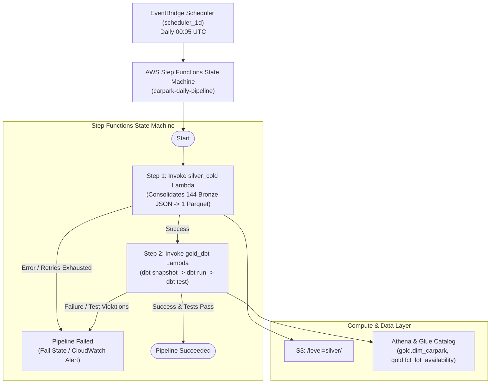

# Gold Layer (`packages/gold`)

The **Gold Layer** is the analytical and dimensional modeling tier of the Carpark Availabilities Data Platform. It transforms partitioned Silver Parquet data into high-performance **Apache Iceberg** dimensional and fact tables managed by [dbt-athena](https://github.com/dbt-athena/dbt-athena) on Amazon Athena and S3.

---

## 1. Architecture Overview



---

## 2. Dimensional Data Models

### 2.1 Staging View: `stg_silver__carpark_snapshots`
* **File**: [`models/staging/stg_silver__carpark_snapshots.sql`](models/staging/stg_silver__carpark_snapshots.sql)
* **Materialization**: `view`
* **Purpose**: Deduplicates and cleans raw snapshots from `silver.silver_cold` taking the freshest record per `(carpark_id, lot_type, snapshot_timestamp)`.

### 2.2 Dimension Snapshot: `snp_carpark`
* **File**: [`snapshots/snp_carpark.sql`](snapshots/snp_carpark.sql)
* **Strategy**: `check` on `['total_lots', 'development', 'area', 'agency', 'location_latitude', 'location_longitude']`
* **Unique Key**: `carpark_id || '_' || lot_type`
* **Purpose**: Captures Slowly Changing Dimension (SCD Type 2) history when carpark capacity, metadata, or coordinates change over time.

### 2.3 Dimension Table: `dim_carpark`
* **File**: [`models/dimensions/dim_carpark.sql`](models/dimensions/dim_carpark.sql)
* **Materialization**: `incremental` (Apache Iceberg Table, merge strategy)
* **Primary Key**: `carpark_key = to_hex(md5(to_utf8(carpark_id || '_' || lot_type || '_' || cast(valid_from as varchar))))`

### 2.4 Fact Table: `fct_lot_availability`
* **File**: [`models/facts/fct_lot_availability.sql`](models/facts/fct_lot_availability.sql)
* **Materialization**: `incremental` (Apache Iceberg Table, partitioned by `snapshot_date`)
* **Primary Key**: `availability_id = to_hex(md5(to_utf8(carpark_id || '_' || lot_type || '_' || cast(snapshot_timestamp as varchar))))`
* **Point-in-Time Join**: Joins snapshots to `dim_carpark` on:
  ```sql
  s.snapshot_timestamp >= d.valid_from 
  AND (s.snapshot_timestamp < d.valid_to OR d.valid_to IS NULL)
  ```
* **Enriched Metrics**:
  * `lots_occupied = total_lots - lots_available`
  * `occupancy_rate = round((total_lots - lots_available) / total_lots, 4)`
  * `is_full = (lots_available == 0)`

---

## 3. Data Quality & Assertion Tests

Custom SQL tests in [`tests/`](tests/) enforce domain integrity on every execution:

| Test Name | File | Rule Enforced |
| :--- | :--- | :--- |
| **Singapore Geo Bounds** | `assert_singapore_geo_bounds.sql` | Carpark coordinates must fall within Singapore bounds ($1.15 \le \text{Lat} \le 1.48$, $103.55 \le \text{Lon} \le 104.10$). |
| **Capacity Constraint** | `assert_lots_available_le_total_lots.sql` | `lots_available` must never exceed `total_lots` when `total_lots` is defined. |
| **Occupancy Rate Range** | `assert_occupancy_rate_bounds.sql` | `occupancy_rate` must be within $[0.0, 1.0]$ ($0\%$ to $100\%$). |
| **SCD2 Overlap Check** | `assert_scd2_no_overlaps.sql` | No overlapping `[valid_from, valid_to)` intervals for any `(carpark_id, lot_type)`. |

---

## 4. Local Development & Makefile Commands

Convenience targets in the root `Makefile` allow local execution using `uv`:

```bash
# 1. Fast local compilation check (validates SQL/Jinja/YAML without AWS queries)
make dbt_parse

# 2. Test Athena connection and S3 bucket permissions
make dbt_debug

# 3. Execute SCD Type 2 snapshot
make dbt_snapshot

# 4. Build staging views, dimensions, and facts
make dbt_run

# 5. Run full suite of generic schema tests and custom SQL assertions
make dbt_test
```

---

## 5. Deployment & Execution Runbook

### Build and Push Containers to ECR:
```bash
# Builds and pushes both silver_cold and gold container images to ECR:
make push

# Updates image digests in infra/app/digests.auto.tfvars.json:
make digests
```

### Apply Infrastructure via Terraform:
```bash
make apply
```

### Manually Trigger the Daily Step Functions Pipeline:
```bash
# Retrieve State Machine ARN from Terraform output
SFN_ARN=$(terraform -chdir=infra/app output -raw step_function_arn)

# Trigger execution via AWS CLI
aws stepfunctions start-execution \
  --state-machine-arn $SFN_ARN \
  --name manual-test-$(date +%s)
```
